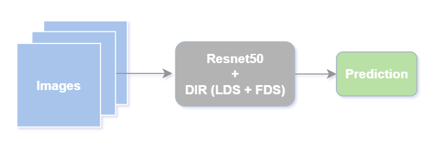
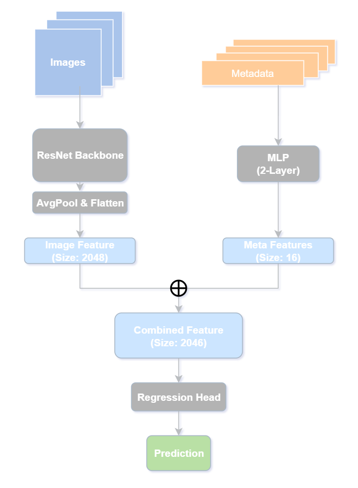
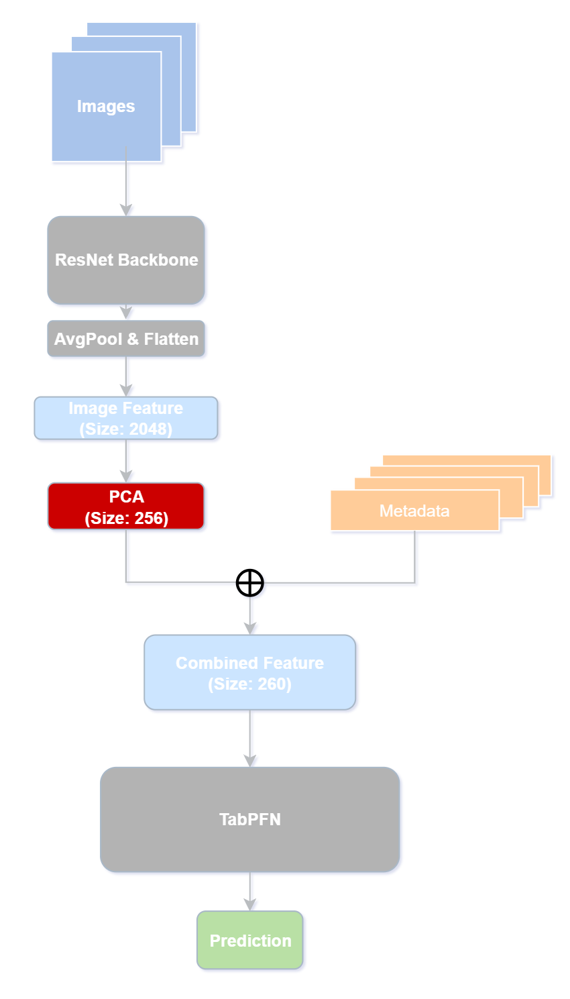

# Skyfinder Temperature Prediction with Deep Imbalanced Regression (DIR) and Multimodal methodologies

This repository implements different approaches in deep learning for temperature regression using the **Skyfinder** dataset. 

This project also integrate **Deep Imbalanced Regression (DIR)** techniques, that addresses the performance degradation typically seen at extreme temperature ranges.

## 📊 Dataset: Skyfinder
The [Skyfinder dataset](https://cs.valdosta.edu/~rpmihail/skyfinder/) contains over 80,000 labeled instances captured from 47 cameras between 2011 and 2014.

* **Content**: High-resolution scene images paired with environmental metadata (humidity, location, season, time).
* **Imbalance Problem**: The dataset exhibits a classic skeId, long-tailed distribution. Standard machine learning models naturally overfit to common "many-shot" temperature regions, leading to high bias and poor performance when predicting rare, critical extreme values.

## 🧠 Methodology: Deep Imbalanced Regression (DIR)
I utilize the DIR framework proposed by [Yang et al. (2021)](https://dir.csail.mit.edu/) to improve generalization across the entire continuous target range.

* **Label Distribution Smoothing (LDS)**: Estimates the "effective" label density by convolving a symmetric kernel with the empirical distribution to account for information overlap betIen nearby continuous targets.
* **Feature Distribution Smoothing (FDS)**: Calibrates biased feature statistics (mean and covariance) by leveraging similarities betIen neighboring temperature bins in the feature space.

## 🛠️ Approach
Our experiments are divided into three primary modeling strategies:
1.  **Image-based Model + DIR**: Utilizing a ResNet50 backbone enhanced with LDS and FDS.
2.  **Metadata-based Model**: A standalone regressor focusing on environmental features.
3.  **Multimodal Fusion**: An ensemble architecture that concatenates visual encodings with metadata features before final regression.

**Experimental results demonstrate that multimodal fusion methods significantly outperform any single-modality approach.**

## 🧹 Data Preprocessing & Splitting
* **Cleaning**: Filtered corrupted files and extreme outliers (e.g., `-9999`), resulting in a final dataset of **81,044** files.
* **Camera-based Split**: Data is split by unique camera IDs to ensure model generalizability. The test set acts as an external dataset to evaluate real-world performance.
* **Balanced Evaluation**: Following DIR best practices, validation and test sets are capped at **200 cases per label** to ensure a uniform distribution for an unbiased assessment.

## ⚙️ Implementation Details
To adapt the original DIR implementation to temperature data, I configured the following:

1.  **Label Shifting**: The temperature range (-27°C to 50°C) is shifted by **+30** to ensure all target bins are positive integers for indexing.
2.  **Bucketing**: `bucket_num` is set to **80** to cover the full shifted range (0-80).
3.  **Shot Thresholds**: Adapted frequency cut-offs to better suit the Skyfinder scale:
    * **Many-shot**: >1000 samples.
    * **Medium-shot**: 100 - 1000 samples.
    * **Low-shot**: <100 samples.

## 📈 Performance Comparison
I compared the Vanilla ResNet50 against various DIR configurations.

| Method | Overall MAE | Many-Shot MAE | Median-Shot MAE | Low-Shot MAE |
| :--- | :---: | :---: | :---: | :---: |
| **Vanilla** (ResNet50) | 9.604 | 7.153 | 14.935 | 22.407 |
| **LDS Only** | 9.708 | 7.686 | 13.167 | 22.076 |
| **FDS Only** | 10.666 | 8.077 | 15.412 | 25.893 |
| **DIR (LDS + FDS)** | **8.216** | **6.227** | **12.053** | **19.558** |

**Conclusion**: The DIR method (LDS + FDS) successfully outperformed all other configurations, specifically in the **Low-shot** region, demonstrating its effectiveness in predicting extreme temperature values.

Below is the basic pipeline for how I utlize ResNet50 in this approach:

  

## Beyond Image-Only: Multimodal Fusion

Predicting temperature accurately can be challenging when relying solely on visual cues from a window. To address this, I leverage the rich metadata provided by the **Skyfinder** dataset to build a more robust model.

### Addressing Data Leakage
While metadata like dew point or humidity are highly predictive, they often correlate so closely with temperature that including them can lead to **data leakage**—where the model "cheats" by using information that wouldn't be available or would be redundant in a real-world deployment. 

To ensure the model is practical and generalizable, I utilize only the most accessible geographical and temporal information:
* **Latitude**
* **Longitude**
* **Month**
* **Hour**

### Multimodal Architecture: Parallel Feature Fusion
Our first approach involves a late-fusion strategy to combine visual and tabular data:

1.  **Visual Branch**: The image passes through a **ResNet-50** backbone to extract a **2048-dimensional** feature vector representing visual scene context.
2.  **Metadata Branch**: In parallel, the four metadata points are fed into a **2-layer Multi-Layer Perceptron (MLP)**, which compresses them into a **16-dimensional** metadata feature vector.
3.  **Concatenation**: These two vectors are concatenated into a single **2064-dimensional** feature representation.
4.  **Regression Head**: This combined vector is passed through the final regression layer to produce the temperature prediction.

Below is the diagram of the workflow of this fusion framework:

  

### Results
By introducing these environmental priors, the model can "anchor" its visual findings to a specific geographic location and time of day. This pipeline resulted in a **profound improvement in performance** across the entire temperature range compared to the image-only baseline. Below is the result:

| Method | Overall MAE | Many-Shot MAE | Median-Shot MAE | Low-Shot MAE |
| :--- | :---: | :---: | :---: | :---: |
| **Multimodal (ResNet + MLP)** | **5.221** | **4.654** | **5.628** | **9.663** |

## Improving the Multimodal Framework: A Tabular-Centric Approach

While my initial approach used a vision-heavy architecture, temperature prediction in the real world is often driven more by geographic and temporal context than by visual cues alone. To better leverage the predictive power of metadata, I developed a second, more advanced framework where the metadata model takes the lead.

### Advanced Fusion with TabPFN
For this approach, I utilized **TabPFN**, a State-of-the-Art (SOTA) transformer-based model specifically designed for tabular data. By treating compressed visual information as additional tabular columns, I created a more balanced and informative feature set.

#### The Pipeline:
1.  **Visual Feature Extraction**: I use the pre-trained ResNet-50 backbone to extract the high-level 2048-dimensional visual features.
2.  **PCA Compression**: Because TabPFN is optimized for a specific number of features, I apply **Principal Component Analysis (PCA)** to compress the 2048-d visual vector into **256 dimensions**. This maintains the most critical visual information while making the data compatible with the tabular model.
3.  **Feature Concatenation**: I combine the 4 core metadata points (Latitude, Longitude, Month, Hour) with the 256 compressed visual features.
4.  **Tabular-Driven Prediction**: This combined 260-column dataset is fed into TabPFN to generate the final temperature regression.

Below is the diagram of the workflow of this fusion framework:

  

### Experimental Results
I compared the performance of TabPFN using metadata alone against the combined image-feature and metadata approach.

| Method | Overall MAE | Many-Shot MAE | Median-Shot MAE | Low-Shot MAE |
| :--- | :---: | :---: | :---: | :---: |
| **Metadata Only (TabPFN)** | **5.1631** | **4.7426** | 6.0816 | 7.3519 |
| **Multimodal (TabPFN + PCA)** | 5.2130 | 5.1656 | **5.1869** | **5.7106** |

### Key Findings
The results confirmed my hypothesis: metadata is incredibly informative for this task, yielding a strong baseline on its own. However, **adding visual features significantly improved the results**, proving that the model successfully learned to use visual scene context (like cloud cover or sunlight) to refine the predictions provided by the geographic and temporal data. 

This approach represents my most effective method for temperature prediction to date, combining the spatial-temporal accuracy of tabular models with the contextual richness of computer vision.

### Conclusion

In conclusion, this project demonstrates that temperature prediction from outdoor imagery is a quintessential **Deep Imbalanced Regression (DIR)** task. By addressing the skewed distribution of the Skyfinder dataset, I was able to significantly mitigate the bias toward common temperature ranges. The implementation of **Label Distribution Smoothing (LDS)** and **Feature Distribution Smoothing (FDS)** proved essential for accurate predictions in the high-impact "low-shot" regions, where standard models typically fail. Furthermore, by evolving the architecture from an image-only baseline to a multimodal framework—specifically utilizing **TabPFN** with compressed visual features—I reached a level of predictive accuracy that single-modality models cannot achieve. This highlights the importance of anchoring visual context to geographic and temporal priors in environmental sensing.

### Results Table

The following table summarizes the performance (Mean Absolute Error) across all evaluated methodologies.

| Method | Overall MAE | Many-Shot MAE | Median-Shot MAE | Low-Shot MAE |
| :--- | :---: | :---: | :---: | :---: |
| **Vanilla** (ResNet50) | 9.604 | 7.153 | 14.935 | 22.407 |
| **LDS Only** | 9.708 | 7.686 | 13.167 | 22.076 |
| **FDS Only** | 10.666 | 8.077 | 15.412 | 25.893 |
| **DIR (LDS + FDS)** | 8.216 | 6.227 | 12.053 | 19.558 |
| **Multimodal (ResNet + MLP)** | 5.221 | **4.654** | 5.628 | 9.663 |
| **Metadata Only (TabPFN)** | **5.1631** | 4.7426 | 6.0816 | 7.3519 |
| **Multimodal (TabPFN + PCA)** | 5.2130 | 5.1656 | **5.1869** | **5.7106** |

---

### Code and Weights

All code for data preprocessing, training pipelines, and evaluation metrics is provided in this GitHub repository.

**Trained Weights**:
* Visual Backbone (ResNet50): 

## 🔗 References
* Yang, Y., Zha, K., Chen, Y. C., Wang, H., & Katabi, D. (2021). [Delving into Deep Imbalanced Regression](https://arxiv.org/abs/2102.09554). ICML.
